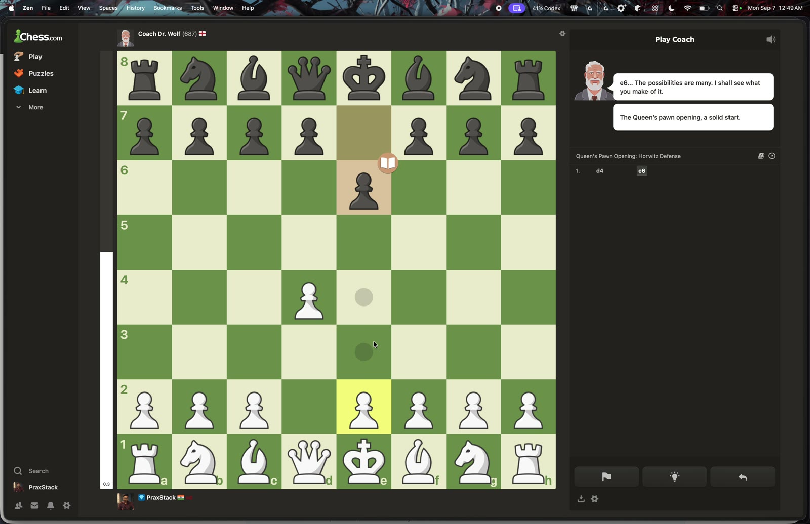
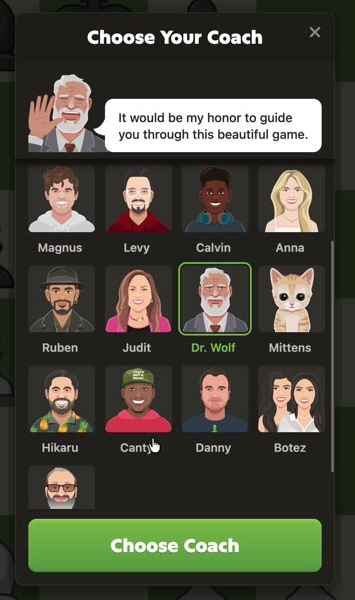
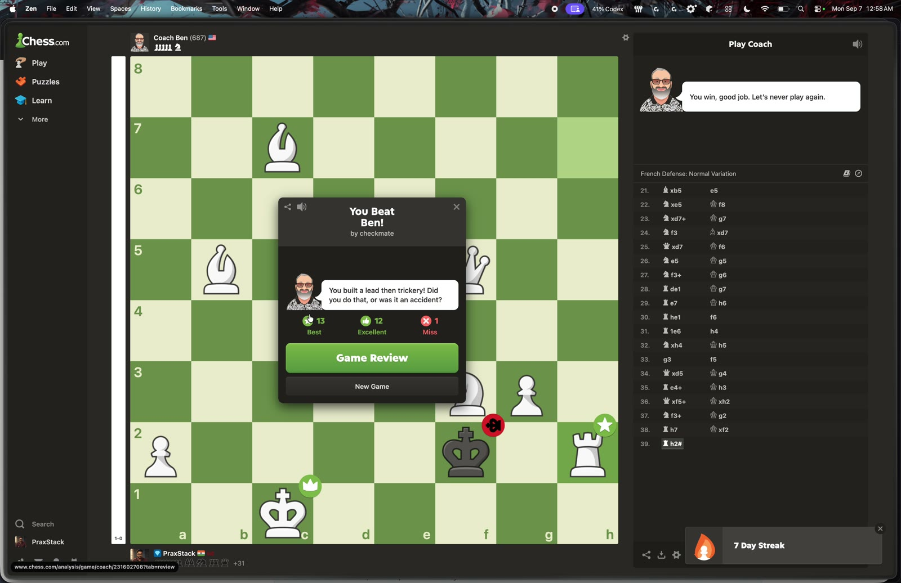
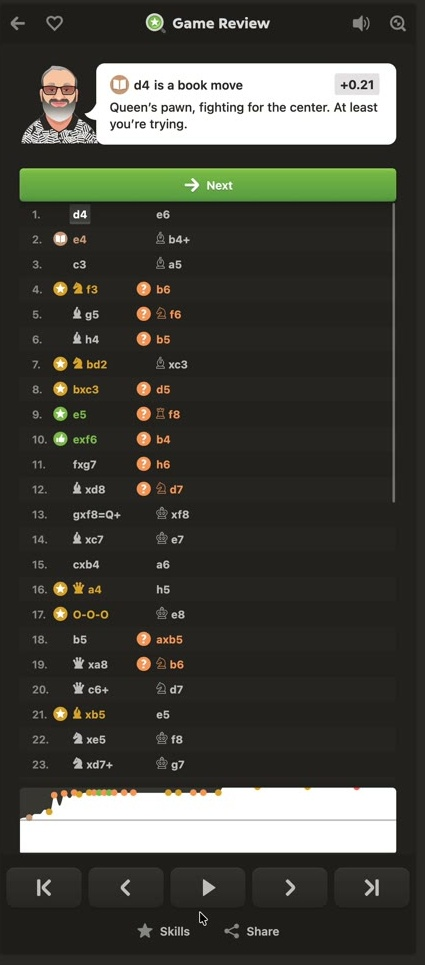
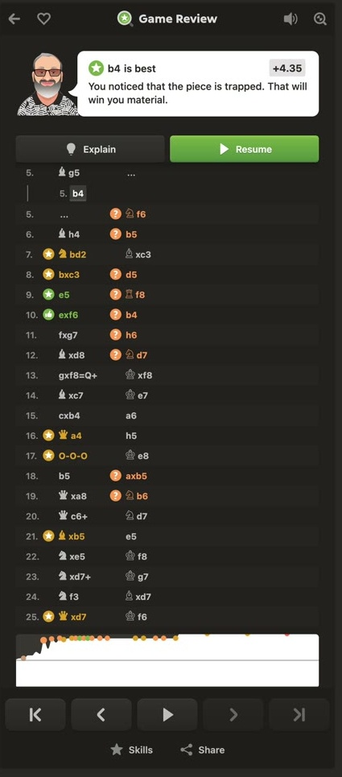
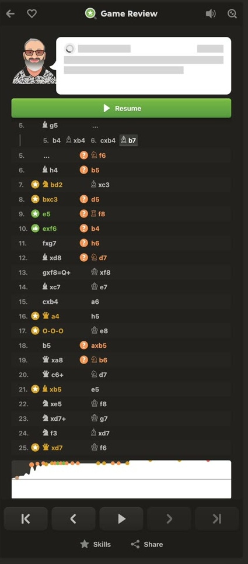
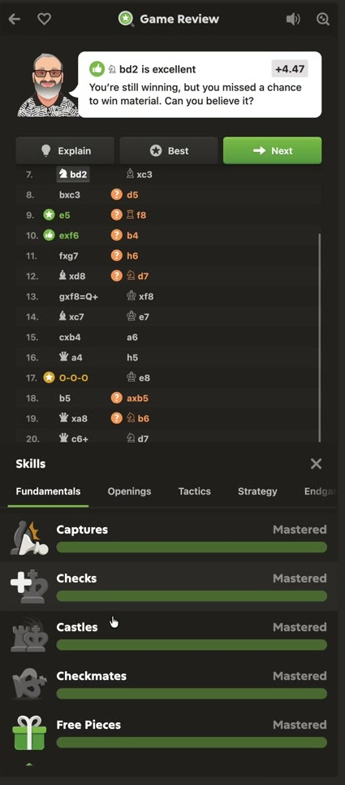

# A closer look at the whole session

**150 exact-time frames, spanning 00:00–15:19.** I inspected the recording as a visual sequence: 93 broad samples, then 57 additional unique frames around settings, coach selection, branching and skills. This is my own frame study, separate from Gemini's earlier interpretation. It is not continuous real-time viewing of every frame or a complete audio review.

[Browse all 150 frames and contact sheets →](frame-atlas.html) · [Settings and every visible option →](settings-study.html) · [What this changes in our screens →](screen-plan.html) · [Play the recording →](video.html)

## How the video was divided

| Segment | Sampling and reason |
| --- | --- |
| Entire 15:20 recording | Exact seeks every 10 seconds, plus 15:19. Eight contact sheets establish the full visual journey. |
| 04:09–04:17 | Two-second samples of the coach picker, scrolling and changed selection. |
| 09:50–10:00 | Result, page transition, loading state and review summary. |
| 10:14–10:51 | One frame every second: settings tabs and briefly open dropdowns. |
| 11:24–13:26 | Additional selected frames around move review, an alternative, the explanation loading state and return. |
| 14:27–14:45 | Two-second samples of the skills drawer and its categories. |

An automatic scene-change pass proposed 11 transition timestamps. It helped locate large screen changes but missed small dropdown changes, so the settings sequence received denser manual inspection. Frames came from the original recording, resized to 1600 pixels wide. The close-ups below are crops of those frames, not generated reconstructions. Timestamps are requested video seek times; do not infer sub-frame event timing.

## 1. Playing: a stable board and a reactive coach

**Observed, 00:20:** global navigation sits on the far left, a large board occupies the center-left, and Play Coach occupies the right. A selected pawn has destination markers. Player information, coordinates, the move list and coach speech share the same workspace. Subsequent samples show move classifications appearing on squares and the coach's message changing.

**ChessLab idea:** preserve this stable spatial arrangement. Attach an editable question to the currently selected move. Explain the selected square, marker and arrow in text as well as color. Keep an obvious distinction between playing a move and temporarily exploring one.

## 2. Coach selection happens without discarding the board

**Observed, 04:11–04:17:** a modal contains an avatar preview, sample greeting, scrollable coach grid, selection outline and Choose Coach action. Dr. Wolf is initially selected; Ben appears lower in the list and is selected before the dialog closes. The same game remains visible behind it. This shows presentation and persona selection; it does not prove different reasoning engines or calibrated playing strengths.

**ChessLab idea:** offer a small choice of explanation detail and tone, with a sample response, while preserving the study. Avatar variety is less important than whether the explanation can answer a follow-up. Do not confuse a coach persona with opponent difficulty.

## 3. A finished game leads into review

**Observed, 09:50:** a result modal shows the outcome, a few move-quality counts, Game Review and New Game. At 09:52 the application is in a mostly blank transition; by 09:54 a review shell and loading dots appear. At 10:00 the summary shows accuracy, classifications, a graph, game-rating estimates and phase summaries.

**ChessLab idea:** add explicit result → analysis-in-progress → review-ready states. Keep the board or a recognizable game summary visible while analysis loads. Offer “Review my confusing move” as well as chronological review. These displayed ratings and accuracy figures are Chess.com's output, not validated measures of learning.

## 4. Settings contain several separate products

**Observed:** Engine, Interface and Board are separate top-level tabs. Interface exposes Analysis and Review subtabs; only Review's contents are shown in the inspected sequence. Engine separately groups Game Review, Analysis and Cloud. The [settings inventory](settings-study.html) records the 26 visible controls and the dropdown lists actually opened.

**ChessLab idea:** keep simple learning preferences close to the board, and put engine resources in an advanced section. Analysis strength is not opponent difficulty. No technical engine choice is needed just to ask why a move fails.

## 5. Review is a workspace, not only a scorecard

**Observed, 11:24 onward:** the right column combines a coach card, move assessment and numerical evaluation, Explain/Best/Next actions depending on the position, annotated move history, graph, first/previous/play/next/last transport controls, Skills and Share. At 11:50–12:10, multiple colored arrows appear on the board.

**ChessLab idea:** give each arrow a purpose and a matching explanation sentence. A dense move list should remain available, but the selected position, question and return point should be easier to identify than the surrounding statistics. Add a “show one step” control so several arrows do not become an unexplained diagram.

## 6. Alternatives and a return action already exist

**Observed, 12:49:** b4 appears as an indented alternative; the coach card changes and Resume is visible. At 13:06 and 13:14, further moves appear within that variation while the explanation card displays loading placeholders. At 13:26, the original Bg5 review card is visible again and the alternative remains in the move list.

**ChessLab idea:** make the alternate line's origin, side to move and exact return destination explicit. Keep follow-up questions attached to that branch. The loading state must not leave old explanatory text attached to a newly displayed position. An indented line in this recording is evidence of variation support; it does not establish all of the nested conversation and persistence behavior we want.

No free-form question composer is visible in these sampled coaching and review states. This is a statement about the recording, not a claim about every Chess.com feature.

## 7. Skills are integrated into review

**Observed:** the Skills drawer reuses the lower portion of the review column while retaining the selected move above it. Its five categories are Fundamentals, Openings, Tactics, Strategy and Endgames. Rows show progress or “Mastered”; later, a Develops Pieces annotation appears on the board with a matching skill row.

| Category and frame | Visible rows |
| --- | --- |
| Fundamentals, 14:31 | Captures; Checks; Castles; Checkmates; Free Pieces |
| Openings, 14:27 | Develops Pieces; Pawns in Center; Strikes at Center; Connects Rooks; Completes Development |
| Tactics, 14:39 | Recaptures; Winning Captures; Blocks Attacks; Forks; Pins |
| Strategy, 14:41 | Develops with Tempo; Damages Pawn Structures; En Passant; Improves Pawn Structure; Pawn Storms |
| Endgames, 14:43 | Promotions; Ladder Mates; Backrank Mates; Pushes Passed Pawns; Queen Checkmates |

**ChessLab idea:** connect a saved misunderstanding to examples from the actual game and one related retry. Keep “observed in a game,” “explained by the learner,” and “successfully retried later” separate. The recorded counters do not prove mastery, and the full scoring rules are not visible.

## What I would carry forward

The strongest reusable structure is **one stable board with context-sensitive panels**. The most important addition is a question-and-branch workspace with a persistent return anchor. We need more explicit states, not 20 unrelated dashboards: selected move, predicted move, alternate reply, explanation loading, evidence ready, comparison and restored original.

The recording also contains macOS screen-sharing and system menus. Those are external overlays and should not be mistaken for Chess.com settings. Import, difficulty setup, billing, keyboard behavior, mobile layout and save-after-reload behavior are not demonstrated here. They remain separate design or testing work.
