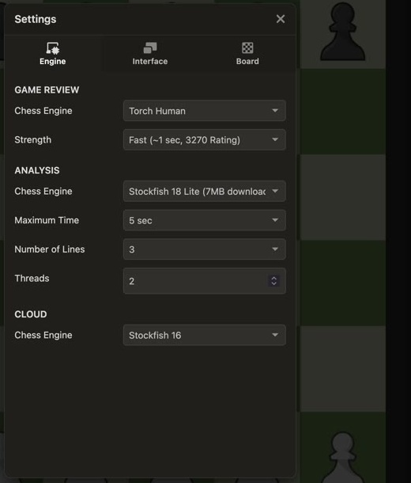
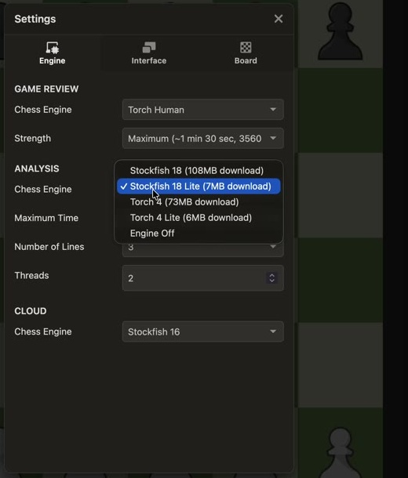
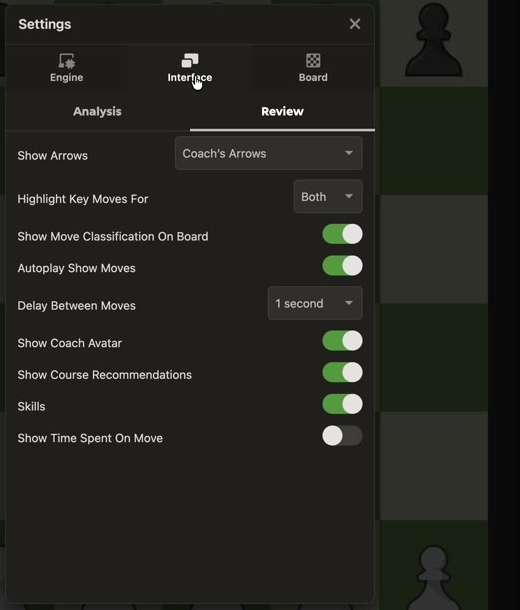
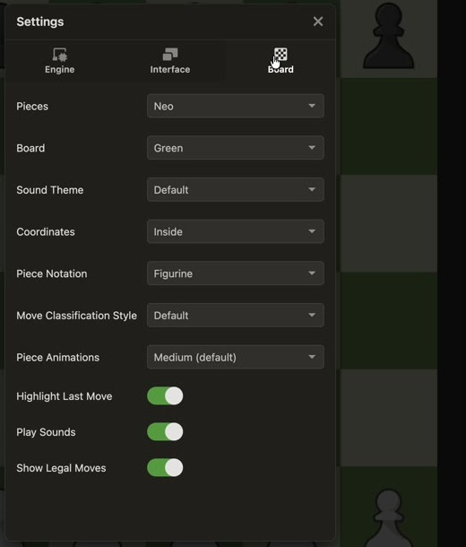

# Settings, transcribed from the frames

**26 visible controls across Engine, Interface → Review, and Board.** Values below describe this recorded session. They are not recommendations, verified engine ratings, or an exhaustive inventory of every Chess.com setting. An unopened dropdown tells us its displayed value, not all its possible options.

[Frame study →](frame-study.html) · [Screen implications →](screen-plan.html)

## Engine: three distinct scopes

| Scope / control | Visible options or value | Evidence |
| --- | --- | --- |
| Game Review / Chess Engine | Open list: Stockfish; Torch Human. Torch Human selected. | [10:26](video/study/frames/0626.jpg) |
| Game Review / Strength | Fast (~1 sec, 3270 Rating); Standard (~5 sec, 3430 Rating); Deep (~20 sec, 3500 Rating); Maximum (~1 min 30 sec, 3560 Rating). Fast initially; Maximum displayed later. | [10:28](video/study/frames/0628.jpg), [10:32](video/study/frames/0632.jpg) |
| Analysis / Chess Engine | Stockfish 18 (108MB download); Stockfish 18 Lite (7MB download); Torch 4 (73MB download); Torch 4 Lite (6MB download); Engine Off. Lite initially; Stockfish 18 displayed later. | [10:33](video/study/frames/0633.jpg), [10:37](video/study/frames/0637.jpg) |
| Analysis / Maximum Time | 3 sec; 5 sec; 10 sec; 20 sec; 30 sec; Unlimited. Initially 5 sec; later 10 sec. | [10:38](video/study/frames/0638.jpg), [10:42](video/study/frames/0642.jpg) |
| Analysis / Number of Lines | 1, 2, 3, 4, 5. Initially 3; later 5. | [10:40](video/study/frames/0640.jpg), [10:42](video/study/frames/0642.jpg) |
| Analysis / Threads | Numeric stepper displaying 2. Minimum, maximum and resource impact not demonstrated. | [10:42](video/study/frames/0642.jpg) |
| Cloud / Chess Engine | Open list: Stockfish 16; Komodo Dragon. Stockfish 16 selected. | [10:44](video/study/frames/0644.jpg) |

The time/rating pairings above are labels in the recorded UI. They do not independently prove search speed, engine strength or the presence of any particular backend implementation. Selecting a value does not prove a download finished or that an earlier review was recomputed.

**For ChessLab:** a simple “Analyze further” action can precede advanced controls for time and candidate count. Show progress, cancellation, engine version and the limits attached to a result when relevant. Keep opponent difficulty in game setup. Never imply that increasing analysis time raises the learner's rating or changes the opponent's behavior.

## Interface → Review

| Control | Visible value at 10:20 | What remains unknown |
| --- | --- | --- |
| Show Arrows | Coach's Arrows | Other dropdown choices were not opened. |
| Highlight Key Moves For | Both | Other dropdown choices were not opened. |
| Show Move Classification On Board | On | Classification algorithm not visible. |
| Autoplay Show Moves | On | Exact triggers and interruption behavior not tested. |
| Delay Between Moves | 1 second | Other intervals not opened. |
| Show Coach Avatar | On | Effect on layout not tested. |
| Show Course Recommendations | On | Recommendation rules not visible. |
| Skills | On | Full tracking and scoring rules not visible. |
| Show Time Spent On Move | Off | Data availability and display behavior not tested. |

An Analysis subtab is visible beside Review, but its contents were not shown in the inspected settings sequence. I have not invented its controls.

**For ChessLab:** offer explanation detail, arrow visibility, animation pace and optional autoplay without overwhelming the learner. Our “try it yourself” flow should wait for a prediction before revealing a continuation. That is a proposal, not behavior established by these settings. Turning off an avatar should not remove the explanation.

## Board

| Control | Displayed value at 10:17 |
| --- | --- |
| Pieces | Neo |
| Board | Green |
| Sound Theme | Default |
| Coordinates | Inside |
| Piece Notation | Figurine |
| Move Classification Style | Default |
| Piece Animations | Medium (default) |
| Highlight Last Move | On |
| Play Sounds | On |
| Show Legal Moves | On |

The first seven are closed selectors; the last three are toggles. Their complete option lists were not opened during this sequence. The screenshot supports recording the values above, not supplying a guessed theme catalog.

**For ChessLab:** retain the blue preference, readable coordinates and clear legal-move feedback. Include reduced motion, sufficient contrast, keyboard move entry and text alternatives as our accessibility requirements. These requirements are not claims that equivalent controls were observed here. Keep legal-move hints separately configurable from revealing a strategically good move.

## Prioritize by the learner's question

| Put close to the board | Keep in settings or advanced analysis | Defer from the first experiment |
| --- | --- | --- |
| Ask; show one step; hide/reveal hint; arrows; return to anchor | Coordinates; notation; sound; motion; explanation detail; analysis limits | Persona catalog; multiple engine downloads; cloud-engine selector; course promotion |

The distinction is functional: the main study should help the learner understand a position. Configuration should support that task without becoming the task itself.
