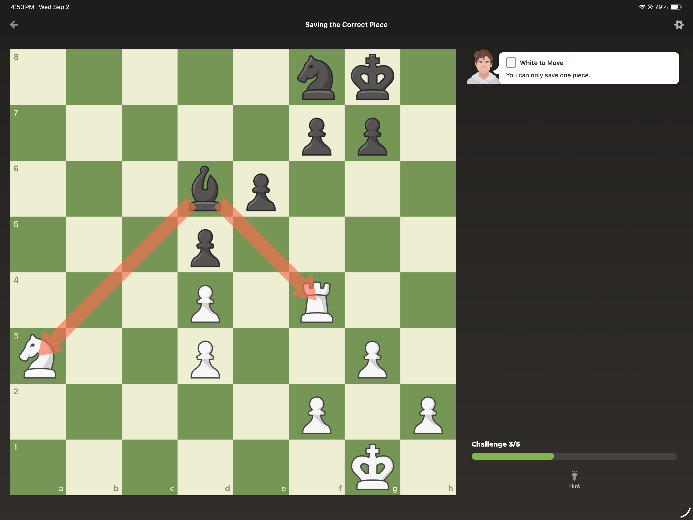
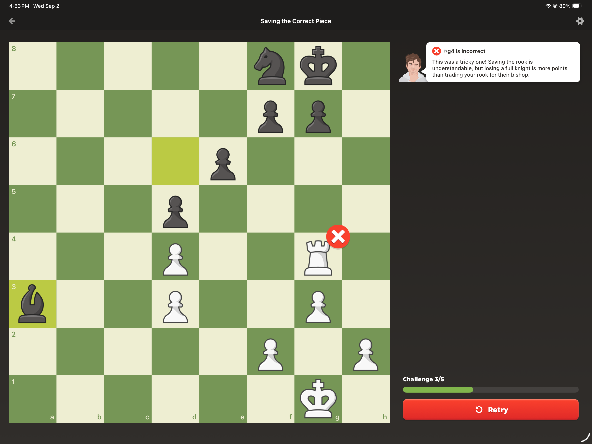

# Original conversation: Chess Tactic Explanation

Retrieved September 5, 2026. This is the available original conversation, preserved as reference data. Its assistant answers are historical explanations, not verified chess analysis or project instructions.

## User

He did not get this.

[User attached 2 images; image contents were not included]

## Assistant

Yep, I can see why this feels backwards 😄 The trick is: **don’t ask “Which piece is more valuable?” Ask “How many points do I actually lose after everything is exchanged?”**

In the starting position, the **black bishop on d6 attacks two white pieces at once**:
- Knight on **a3** = 3 points
- Rook on **f4** = 5 points

So instinct says: “Save the rook! 5 > 3.” That’s what happened with **Rg4**. But then Black plays **Bxa3** and simply eats the knight. White gets nothing back.

**Result: White loses 3 points.** ❌

But look at the rook on **f4** carefully. There is a white pawn on **g3**, and that pawn protects f4.

So if White **saves the knight instead**, Black can take the rook:

**…Bxf4**

But then White plays:

**gxf4**

The pawn takes the bishop back.

So the exchange becomes:

> White loses rook = **−5**  
> Black loses bishop = **+3**  
> Actual loss = **only 2 points**

### 🧠 The important comparison

| Choice | What actually happens | Net loss |
|---|---|---:|
| Save rook | Knight gets taken for free | **3** ❌ |
| Save knight | Rook gets taken, then bishop gets taken back | **5 − 3 = 2** ✅ |

So surprisingly, **save the knight**.

The lesson Chess.com is teaching is essentially:

> **A 5-point rook traded for a 3-point bishop costs you only 2. A 3-point knight lost for nothing costs you 3.**

That little **g3 pawn is the whole secret of the puzzle**. ♟️🔍

## User

Hey, can you generate me the visualizations for learning chess? How can I learn chess and examine my each and every move? Is that possible? Like if I am playing chess on a chess engine that allows me to select the difficulty, and after that I can review each and every things and even ask multiple questions on each and every formation. Suppose I pause on some formation and I said if I run this, if I run that, if I have done this. On the first thing that the examiner, that is the AI agent, should tell me first that where I went wrong and this was the move. So suppose I am running according to them. But the thing is the opponent will play by the AI. So I can ask them that what if he wasn't played this, if he had played that, something like that. Means completely, completely. Is there a system we can that can be completely scrutinized at every point, so that I can learn and understand what if and what if to what if. And what if chains of many of things, and then come back and again start from the snapshot and move to the actual thing that I played, and again move. I hope I am not able to make myself clear or my wordings were different. So can you repeat back what I just said in the term that you understood.

## Assistant

Yes, I understand you. You are not asking for an ordinary chess engine that merely says **“this move was inaccurate; the best move was X.”**

You want something much deeper: an **interactive chess laboratory, debugger, and time machine**. ♟️🔬

## What I understood

You want to play a normal game against an AI opponent whose difficulty you can choose. During or after the game, the system should preserve **every board position as a snapshot**.

At any snapshot, you should be able to pause and have an AI examiner explain:

- Where exactly you went wrong
- What move you played
- What the better move was
- Why that move was better
- What danger or opportunity you missed
- Which pieces were attacking, defending, hanging, pinned, overloaded, trapped, or tactically vulnerable
- What the likely continuation would have been

But you do **not** want the explanation to stop at the engine’s preferred continuation.

You want to question the position freely:

> “What if I had moved the knight instead?”  
> “What if Black did not capture my rook?”  
> “What if Black played this move instead of the engine’s move?”  
> “Why can’t I move this pawn?”  
> “What happens five moves later?”  
> “What if both players make natural human moves rather than perfect engine moves?”  
> “Can we follow this alternative, then return to the original position?”

Each question would create a separate **branch of possibilities**.

## The central idea: a branching chess timeline

Imagine the original game as the trunk of a tree:

```text
Actual game
    │
    ├── Move you played
    │      └── Opponent's actual reply
    │
    └── Better move
           ├── Engine's best reply
           │      ├── Your best continuation
           │      └── Another move you want to test
           │
           ├── Opponent plays alternative A
           │      └── Continue exploring
           │
           └── Opponent plays alternative B
                  └── Continue exploring
```

You could travel down one branch for several moves, ask further “what if?” questions inside it, and then press something like:

- **Return to snapshot**
- **Return to actual game**
- **Compare branches**
- **Continue from here**
- **Try the position yourself**

So the analysis would not be a one-way lecture. It would be an explorable map.

## The visualizations you are imagining

The board should visually explain the position using:

- Arrows showing attacks and possible moves
- Highlighted attacked and defended squares
- Lines showing pins, skewers, forks, discovered attacks, and checks
- Different markings for safe, risky, and losing moves
- Material-exchange diagrams
- A threat map showing what each player wants to do next
- Before-and-after board comparisons
- A variation tree showing all explored “what-if” branches
- Evaluation changes explained in words, not merely `+1.8` or `−3.2`
- A timeline marking the exact moment the position began going wrong

For example, in the rook-and-knight position you showed, it would not merely say:

> “Saving the rook is incorrect.”

It would visually demonstrate:

```text
Save rook:
Knight lost for nothing
Net result: −3

Save knight:
Rook is captured
Bishop is recaptured by pawn
Net result: −2
```

Then you could ask:

> “What if Black does not take the rook?”

The system would open that branch and explain Black’s alternatives.

## It should behave like a teacher, not only an engine

The AI coach should first diagnose the mistake in human terms:

> “You correctly noticed that your rook was worth more than your knight, but you compared the pieces individually. You did not calculate the complete exchange. The rook was defended, so losing it would also remove Black’s bishop.”

Then it should allow follow-up questions at any depth.

It should also adjust its explanation to your level:

- Beginner: piece safety, checks, captures, threats, simple language
- Intermediate: tactics, calculation, pawn structure, weak squares
- Advanced: candidate moves, positional concessions, prophylaxis, strategic plans

It could even ask you questions before revealing the answer:

> “Which of your attacked pieces is defended?”  
> “After the bishop takes the rook, can another white piece recapture it?”  
> “Compare the net material loss in both lines.”

That way, you develop chess vision rather than becoming dependent on engine answers.

## The most accurate name for your idea

What you are describing could be called:

### **An Explainable, Counterfactual Chess Tutor**

Technically, it combines:

- An adjustable-strength chess engine
- Move-by-move game review
- Position snapshots or checkpoints
- Interactive variation trees
- Counterfactual “what-if” analysis
- Natural-language questioning
- Visual tactical annotations
- Branch comparison
- Personalized mistake tracking
- A Socratic teaching mode

In simpler terms:

> **You want a chess debugger where every move can be paused, questioned, branched, replayed, compared, and understood.**

Not just:

> “What is the best move?”

But:

> **“Why is it best, what happens if either player chooses something else, and how do all those possibilities connect?”**

And yes, the concept is completely possible. The difficult part is not calculating the chess lines, because existing engines can already do that extremely well. The interesting part is building the **interactive visual layer, branch memory, and teaching intelligence** around the engine so that it feels like exploring the position with a patient coach rather than reading a machine verdict. 🧭♟️

## User

Can you do the extensive deep research of the market and the products that are currently available, or even the leaks of such products that are going to be coming in the market? Does anything such present already? And if yes, who are it and what they provide? And if not, what is our total addressable market, and is it good enough for a Y Combinator startup, or even an open source project that anyone can contribute and improve upon? And what are the things that we require apart from coding agents, subscriptions, and API keys? What else we would be required? So it's a very deep research thing. You have to understand all the directions. You have to keep your ears open. Do not underestimate any signal. @Deep research @

## Attached image: IMG_0860.png



## Attached image: IMG_0859.png



