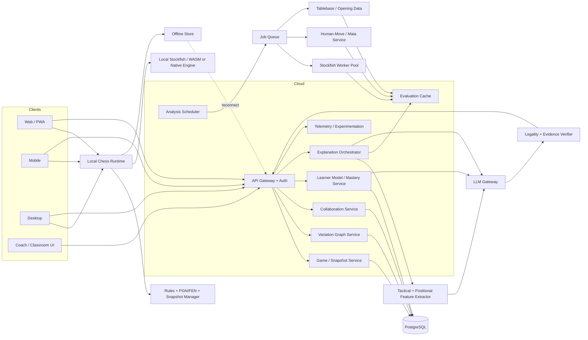
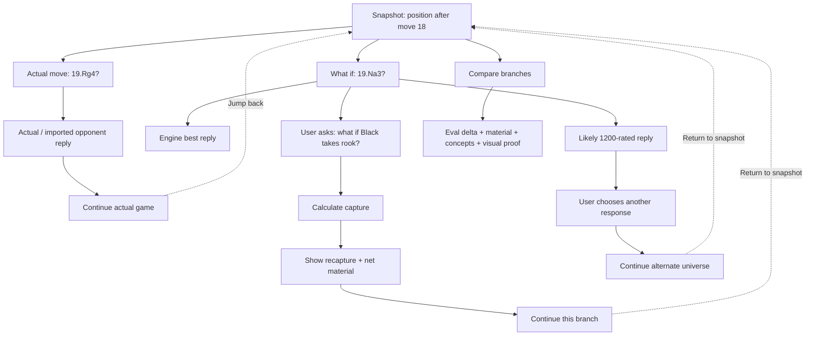

# Interactive, Explainable Chess Tutor/Debugger: Product, Market, Technical and Startup Research

**Research snapshot: September 3, 2026.**

## Executive summary

There is a credible product opportunity for a **branch-native, explainable chess debugger**: a system in which every move becomes a persistent snapshot, every snapshot can spawn arbitrary counterfactual branches, and a learner can ask questions such as “why was my move wrong?”, “what if I played this instead?”, “what if my opponent did not take?”, “show me the tactical proof,” and “return me to the game I actually played.” The underlying chess calculation is already commoditized by engines such as Stockfish; the unsolved product problem is turning engine output into an interactive, pedagogically useful **causal model of a chess position**. Stockfish itself is an open-source UCI engine rather than a GUI or tutor, and its current UCI interface already supports weakened play through `Skill Level`, `UCI_LimitStrength`, and `UCI_Elo`. citeturn9search0turn18search7

The audience is large enough to support a meaningful standalone company. Chess.com reported **252M+ registered members and 9.7M average daily active users in Q1 2026**; FIDE cites an estimated **600–800M people globally who play chess**; Lichess says more than **5M games are played on its platform daily**. Chess.com’s education subsidiaries are meaningful businesses themselves: ChessKid reported 14.8M registered users and 838K MAU in Q1 2026, while Chessable reported 630K active users in the quarter. citeturn19search2turn19search3turn1view5

The market is nevertheless crowded. Chess.com has Game Review, Coach Explanations, bots and an analysis board; Lichess has world-class free analysis and persistent collaborative Studies; DecodeChess explains positions and moves in natural language; Chessvia offers conversational/voice AI coaching and even a developer analysis API; Noctie specializes in human-like opponents; Aimchess specializes in personalized post-game training; Take Take Take entered play-and-learn in 2026 with a human-language AI review experience; Endgame.ai and ChessMonitor are also expanding. citeturn8search0turn13search15turn1view5turn1view1turn6search10turn13search1turn1view3turn20news12turn5search1turn5search2

The opportunity is therefore **not** “put Stockfish next to ChatGPT.” That is already replicable. The defensible product thesis should be:

> **A chess debugger where every explanation is executable.**  
> The user can turn any sentence into a highlighted board proof, turn any alternative into a real branch, continue that branch against an appropriate opponent model, compare it with the original line, and jump back to any earlier snapshot without losing context.

In the products and first-party documentation reviewed for this report, I did **not** find one established product that clearly combines all of the following in one coherent workflow: persistent arbitrary-depth counterfactual trees, free-form Q&A attached to each node, deterministic visual proof of explanations, human-like adjustable opponents, branch comparison, durable personal learning memory, and real-time coach/student collaboration. DecodeChess and Chessvia are closest on explanation; Lichess is strongest on persistent branching/collaboration; Noctie is strongest on human-like sparring; Chess.com has by far the broadest distribution and integrated learning ecosystem. citeturn1view1turn1view2turn6search2turn6search10turn1view5turn13search1turn19search2

My base-case commercial estimate is approximately **$2.1B annual consumer TAM**, a **$504M initial SAM**, and a credible five-year SOM of **$9.6M–$24M ARR**, based on assumptions detailed below rather than third-party market-research forecasts. Chess-only is large enough for a substantial company, but a YC-scale outcome becomes much more compelling if the company ultimately owns the generalized technology for **interactive counterfactual tutoring** rather than remaining simply another chess-analysis website. YC’s Fall 2026 Requests for Startups explicitly argues that AI can bring individualized tutoring to consumer scale; chess is not the specific foundational-childhood-learning category YC requested, but the underlying adaptive one-to-one-tutor thesis is highly aligned. citeturn15search1

My recommended launch sequence is **web/PWA first**, with local Stockfish, PGN/Chess.com/Lichess import, immutable game snapshots, unlimited local branches, a structured tactical feature extractor, evidence-grounded conversational explanations, branch comparison, and a human-like training opponent. Desktop should follow through a lightweight wrapper/native engine; native mobile should follow once the core interaction model has proven retention. Do **not** begin by building rated multiplayer, a social network, an opening-course marketplace, voice-first interaction, or three independent native clients.

A strong MVP is realistically a **five-to-six-month project for three to five strong builders**, with a lean remote/India-heavy cash budget around **$120K–$300K**, excluding founder opportunity cost; a US-heavy team can easily cost **$450K–$900K** over the same period. Those are planning estimates, not quoted vendor prices. The architecture can keep operating costs relatively low by performing shallow-to-medium Stockfish analysis on the client, caching engine evaluations aggressively, and invoking LLMs only to explain already-verified chess evidence.

## Market landscape and competitor inventory

Chess has a particularly favorable AI-product structure: the “ground truth” is unusually strong. Legal moves are deterministic; tactical sequences can be verified; Stockfish can supply high-quality counterfactual evaluations; tablebases can make small endgames exact; and human game databases provide enormous behavioral datasets. Lichess, for example, publishes a CC0 database containing billions of games and, as of August 2, 2026, **394,669,566 evaluated positions**. That makes chess substantially easier to ground than an unconstrained educational domain where an LLM itself must determine what is correct. citeturn1view6

At the same time, the incumbent is formidable. Chess.com crossed 100M members in December 2022 when it completed its acquisition of Play Magnus Group—which brought Chessable, Aimchess, chess24 and other properties into its ecosystem—and had reached 252M+ members by Q1 2026. Historical economics show that paid chess learning can monetize: when Play Magnus Group listed publicly in 2020, FIDE reported more than three million registered users and roughly 35,000 monthly paying customers across the group. citeturn20search0turn19search2turn20search9

### Competitor and product inventory

“Explainability” below means *why-oriented pedagogical explanation*, not merely showing an evaluation bar and principal variation. “Branching” means the ability to explore alternative continuations; **strong** means persistent variation-tree functionality rather than merely showing the engine’s best line. API status refers to publicly documented developer interfaces found in the reviewed materials; “none found” does not rule out private partner APIs.

| Product | Platforms | Relevant functionality | Explainability | Branching / what-if | Adjustable / human-like opponent | Public API / SDK | Current pricing signal | Scale signal |
|---|---|---|---|---|---|---|---|---|
| **Chess.com** | Web, iOS, Android | Game Review, Coach Explanations, analysis board, bots, puzzles, lessons, saved analysis/alternate lines | **Medium–High** for reviewed moves; not documented as arbitrary node-attached conversational debugging | **Medium–High**; analysis board explores lines and saved analysis can contain alternatives | Yes; bots across skill levels | **Yes, but limited:** read-only PubAPI; OAuth/connected-board access has separate developer process | US App Store lists Diamond around $16.99/mo and $119.99/yr; tiers/local pricing vary | **252M+ members; 9.7M avg DAU Q1 2026** citeturn19search2turn8search0turn13search15turn8search2turn8search23turn3search4 |
| **Lichess** | Web, mobile | Stockfish analysis, board editor, opening explorer, collaborative Studies, comments, annotations, persistent variations | **Low machine-language explanation**, excellent raw analysis; users/coaches provide commentary | **Very strong**; Studies are explicitly collaborative collections of positions and annotated variations | Computer opponent available; not primarily human-model-based | **Excellent public API**; open source and open databases | Free; donation-funded | User count not disclosed in cited material; **>5M games/day** citeturn1view5turn8search7turn1view4turn1view6 |
| **DecodeChess** | Web; mobile availability via app ecosystem | Explains pros/cons of moves, threats, plans, piece functionality and alternative moves using Stockfish + proprietary AI | **High** | **High exploration**, although less obviously a durable collaborative Git-like tree | Adaptive computer opponent | No public developer API found | Limited/free access plus paid service; exact public indexed price not used here | Not disclosed citeturn1view1turn1view2turn0search10 |
| **Chessvia** | Web/mobile-browser oriented | “Chessy” conversational AI coach; voice/text; remembers games/conversations; game review; free analysis | **Very high conversationally** | **Medium**; arbitrary Q&A is strong, durable multi-branch workspace less clearly documented | Adaptive coaching/player-level behavior | **Yes:** position analysis, natural-language Q&A, move-by-move game review and configurable coaching API | Free analysis plus paid conversational coaching; trial available | Company reports **5,000+ students** through programs/partnerships citeturn6search2turn6search4turn6search10turn6search16turn6search20 |
| **Noctie** | Web, iOS, Android | Human-like AI sparring, 25-level app experience, instant move grading, openings, custom positions, mistake-derived puzzles | **Medium**; strong feedback, less focused on deep natural-language causal dialogue | **Medium**; custom positions and sparring, not a documented persistent counterfactual graph | **Very strong differentiator**; trained to mimic human play and mistakes | No public API found | **€14/mo or €96/yr**, seven-day trial | Not disclosed citeturn13search1turn13search10turn13search4 |
| **Aimchess** | Web; mobile apps | Imports online games, identifies weaknesses, personalized training plans/reports, coach sharing | **Medium** at aggregate/player-development level | **Low–Medium** for arbitrary branch exploration | Not its core proposition | No public API found | Official web pricing: **$7.99/mo or $57.99/yr** Premium | Not disclosed citeturn1view3 |
| **Take Take Take** | Web, iOS, Android | New play/learn/social platform; AI game review designed to “speak like a human,” progress/social layer, Lichess integration | **Medium–High**, rapidly developing | **Medium** based on currently documented workflow | Play product exists; human-model depth not established publicly | No public developer API found | Public pricing not clearly disclosed in reviewed sources | Previous fan app reported **200K downloads**; current product says thousands have moved over; Crunchbase lists company as seed-stage citeturn5search0turn5search11turn5search13turn21search0 |
| **Endgame.ai** | Web | Online play, tournaments, puzzles, AI analysis/insights, named AI bots, clubs/leaderboards | **Medium**, details less publicly documented than Decode/Chessvia | **Medium / unclear** | Yes | No public API found | Not clearly disclosed | Not disclosed citeturn5search1turn20news12 |
| **ChessMonitor** | Web, iOS/Android | Deep account analytics, opponent preparation, databases, Studio beta, multi-account analysis | **Low–Medium explanatory**, high analytical depth | **Medium–High** for analytical/preparation workflows | Not core | No general-purpose public analysis API found | Basic/Plus/Professional tiers; indexed source did not expose reliable current amounts | Not disclosed citeturn5search2turn5search5turn6search1 |
| **CircleChess / Caissa** | Web plus mobile ecosystem | 24/7 AI coach, game analysis, position/calculation/intuition trainers, integration with human coaching | **High coaching orientation** | **Medium**; branch-native debugger behavior not clearly documented | Training platform, not primarily sparring-bot product | No public developer API found | Mixed AI + human-coaching model; prices vary by program | Company reports thousands of families/students; first introduced Caissa publicly in 2024 citeturn13search8turn13search24turn13search11 |
| **Fritz / ChessBase** | Primarily Windows desktop plus companion ecosystem | Professional analysis databases, engine analysis, style simulation, opponent preparation, deep variation work | **Low–Medium** compared with conversational AI; extremely deep expert tooling | **Very strong traditional variation analysis** | Fritz supports style/strength simulation | UCI engines are interoperable, but no comparable consumer conversational API found | **Fritz 21 €69.90**; ChessBase/Fritz bundle around **$224 ex-VAT** in current shop listing | User count not publicly stated in cited material citeturn14search12turn14search6turn14search18 |
| **En Croissant** | Cross-platform desktop | Open-source GUI; imports/organizes online games, multiple UCI engines, analysis, databases, opening/repertoire training | Engine-based rather than LLM-first | **Strong traditional analysis** | Any supported UCI engine | **Code itself is open source** | Free/open source | GitHub/community project; commercial user base not disclosed citeturn12search12turn12search27 |

The strategic gap is clearer when these products are grouped by their strongest capability. **Chess.com** owns breadth and distribution; **Lichess** owns open, persistent study/variation infrastructure; **DecodeChess and Chessvia** are strongest on language explanation; **Noctie** is strongest on human-like sparring; **Fritz/ChessBase** remains a deep professional analysis environment. The proposed product should not try to beat all of them feature-for-feature. It should own the intersection: **counterfactual navigation + proof-grounded explanation + learner memory.** citeturn19search2turn1view5turn1view1turn6search10turn13search1turn14search12

A second important market signal is renewed startup activity. Reuters reported in April 2026 that Magnus Carlsen-backed **Take Take Take** was expanding into online playing and learning, with a Lichess partnership, while identifying **Endgame.ai and ChessMonitor** as other new ventures entering the ecosystem. Take Take Take’s Crunchbase page currently describes it as a seed-stage company with two funding rounds, though public free access obscures the amounts. citeturn20news12turn21search0

On the requested question of **“leaks” and stealth startups**: I found no sufficiently credible primary-source or high-quality press evidence of a genuinely stealth, materially funded company secretly building the exact branch-native explainable debugger described here. Search results contained generic stealth profiles and hobby projects, but nothing reliable enough to present as intelligence. The defensible emerging-competitor set is therefore the publicly verifiable one above rather than rumor. Reuters’ identification of Take Take Take, Endgame.ai and ChessMonitor is the strongest current signal that investors/operators see renewed opportunity in chess software. citeturn20news12

There is also adjacent competitive pressure from broad education platforms. Duolingo now has a chess product, while Chessable continues to build a substantial active-learning audience around its spaced-repetition MoveTrainer model. Neither is currently the same product as a forensic chess debugger, but both illustrate that chess learning is increasingly being treated as an interactive consumer-learning category rather than merely an engine-analysis category. citeturn3search19turn7search19turn19search2

## Market size, business model, and YC fit

A top-down chess TAM based on “everyone who knows chess” would be misleading. FIDE’s 600–800M estimate establishes cultural reach, not willingness to buy AI tutoring. More useful anchors are Chess.com’s 252M+ registered accounts and 9.7M average DAU, Lichess’s >5M daily games, and demonstrated paid chess-training businesses such as the historical Play Magnus Group subscription base. citeturn19search3turn19search2turn1view5turn20search9

I would therefore use an **assumption-driven operating model** rather than cite a generic “AI chess market” report.

| Market layer | Base assumption | Calculation | Annual opportunity |
|---|---:|---:|---:|
| **TAM: global digital improvers** | 25M players worldwide who are sufficiently active, improvement-oriented and economically reachable; target blended ARPU **$84/year** | 25M × $84 | **$2.10B/year** |
| TAM low scenario | 15M × $72 |  | **$1.08B/year** |
| TAM high scenario | 40M × $96 |  | **$3.84B/year** |
| **SAM: initial English-language, roughly beginner-to-advanced-club segment** | 6M potential users reachable through web/mobile, Chess.com/Lichess imports, creators and coaches | 6M × $84 | **$504M/year** |
| **SOM base, year five** | 100K paying subscribers at $96 realized annual ARPU | 100K × $96 | **$9.6M ARR** |
| **SOM stretch, year five** | 250K paying subscribers | 250K × $96 | **$24M ARR** |

The 25M TAM-user assumption is only about **3–4% of FIDE’s estimated global chess-playing population** and roughly **10% of Chess.com’s Q1 2026 registered membership**, making it much less aggressive than counting all chess players as purchasers. The revenue assumption is also consistent with observed consumer pricing: Aimchess charges $7.99/month or $57.99/year, Noctie charges €14/month or €96/year, and Chess.com’s US App Store currently lists Diamond around $16.99/month and $119.99/year. citeturn19search3turn19search2turn1view3turn13search10turn3search4

The weak point in the TAM is **conversion, not audience size**. Historical Play Magnus Group data showed roughly 35K monthly payers on three million registered users in 2020—about 1.2% of registrations, though the products, maturity and denominator make that an imperfect benchmark. To reach 100K paying users, a startup would probably need somewhere around **2–5M meaningfully engaged free users** if eventual free-to-paid conversion settled in a 2–5% range. That conversion range is my planning assumption, not an observed chess-industry average. citeturn20search9

The best consumer packaging is consequently freemium:

| Tier | Recommended economics | Product |
|---|---:|---|
| **Free** | $0 | Local analysis, unlimited manual branches, PGN import, basic tactical overlays, limited cloud explanations |
| **Pro** | **$9.99/mo or $79–89/yr** | Deep explanations, unlimited conversational what-ifs, branch comparison, personalized weakness memory, cloud sync, advanced human-like bots |
| **Coach** | **$19–39/mo** | Shared student trees, live annotations, assignments, comments, student analytics, reusable lessons |
| **Academy / school** | **$3–8/student/month**, annual contract | Rosters, teacher dashboard, safe collaboration, progress reports, centralized content |
| **Developer API** | Metered | Structured evaluation + motif extraction + grounded explanation API |
| **Enterprise / federation** | Contract | White labeling, SSO, coaching analytics, events/training infrastructure |

A particularly promising model is **open-core**: make the board, PGN/FEN handling, local branch tree, offline Stockfish integration and perhaps the core “chess evidence” schema open source, while charging for hosted LLM tutoring, synchronization, multiplayer collaboration, longitudinal learner models, teams and managed compute. Lichess demonstrates that an enormous free/open-source chess platform can attract daily activity at global scale, although its donation-supported economics are different from a venture-backed SaaS business. citeturn1view4turn1view5

The strongest moat would not initially be proprietary engine strength. It would be the **learner graph** accumulated over time: which positions a person misunderstood, which alternatives they considered, which tactical motifs they repeatedly missed, what questions they asked, which explanations actually corrected the misunderstanding, and whether the concept transferred to later positions. An ordinary game database tells you *what players did*. A debugger can gradually acquire data about **why learners were confused**. That is potentially much more valuable for personalization.

YC fit is **good but not automatic**. YC’s Fall 2026 Requests for Startups explicitly argues for AI that can provide individualized tutoring at consumer scale and adapt over long periods to a learner. The chess debugger maps unusually well to this because chess supplies objective feedback and allows the tutor’s explanations to be mechanically checked. The mismatch is that YC’s explicit request focuses on foundational childhood reading, writing and arithmetic—not chess—so this should be presented as a strong application of the same tutoring paradigm, not as “YC specifically asked for chess.” citeturn15search1

My YC-style scorecard would be:

| Dimension | Assessment |
|---|---|
| Pain / existing bad workflow | **Strong** — players regularly encounter opaque “best move” answers without understanding causality |
| Usage frequency | **Strong** for engaged players; a game can generate dozens of learning moments |
| Technical feasibility | **Very strong** — deterministic rules + mature engines + open data |
| Initial market | **Good**, but more niche than horizontal AI education |
| Competitive intensity | **High** |
| Distribution | **Hard** because Chess.com/Lichess already own the game-playing habit |
| AI differentiation | **Medium initially**; high only if explanations are demonstrably better and stateful |
| Data moat potential | **High** if branch/question/learning outcomes are captured |
| Network effects | **Medium**, potentially high through coach/student/shared-study workflows |
| Venture-scale ceiling | **Moderate–high** in chess alone; substantially higher if the underlying counterfactual tutoring framework expands |
| Overall | **~7/10 as chess-only; ~8–9/10 if chess is the wedge for a broader interactive tutoring platform** |

The most compelling YC pitch is therefore not “we built another AI chess coach.” It is:

> **Engines tell 600M chess players what the right move is. We are building the debugger that teaches them why—by letting them execute every question as a counterfactual branch. Chess is our first domain because every explanation can be verified.**

Chess also has proven acquisition economics: Chess.com completed the acquisition of Play Magnus Group in December 2022, after the group had previously reached an approximately $85.8M equity valuation at its 2020 listing. That does not imply a similar exit valuation for a new company, but it demonstrates that strategic acquisition is a real outcome in digital chess learning. citeturn20search0turn20search9

## Academic, open-source, and emerging startup landscape

The academic literature strongly supports separating **optimal chess** from **human chess**. The Maia work showed that engines optimized for playing strength are poor models of the moves humans actually choose, motivating neural models trained specifically to predict human decisions at different rating levels. Maia-2 subsequently generalized this approach into a unified skill-aware model across rating levels. This matters directly for the proposed product: when a learner asks “what would a 1200-rated opponent probably do?”, the correct product response is not necessarily Stockfish’s principal variation. citeturn11search1turn11search21

A useful research inventory is:

| Research project | Contribution | Direct product implication |
|---|---|---|
| **Automated Chess Commentator Powered by Neural Chess Engine** — ACL 2019 | Connects neural chess representation with natural-language commentary, including description, comparison and planning commentary | Establishes that commentary can be conditioned on chess representations rather than generated from raw notation alone citeturn11search0 |
| **Maia / Aligning Superhuman AI with Human Behavior** | Models human move choices across skill levels rather than maximizing playing strength | Use for believable opponents, expected-human-reply rankings, mistake probability and “what is a player like me likely to miss?” citeturn11search1 |
| **Maia-2** — NeurIPS 2024 | Unified skill-aware model that captures differences in move behavior across skill levels | Better basis than simple Stockfish depth throttling for adaptive sparring and personalized counterfactuals citeturn11search21turn12search6 |
| **Concept-guided Chess Commentary** — 2025 | Grounds commentary in interpretable chess concepts rather than unconstrained text generation | Strong blueprint for evidence → concept → explanation pipelines citeturn11search23turn11search4 |
| **Towards Piece-by-Piece Explanations for Chess Positions** — 2025 | Addresses the opacity of reducing an entire position to one scalar centipawn score | Supports piece-level overlays such as “this knight is the problem,” contribution views and local explanations citeturn11search35 |
| **AlphaZero concept-probing / knowledge extraction work** | Finds recognizable human chess concepts in learned chess representations and investigates extraction of concepts | Longer-term route to explanations richer than hand-coded tactical motifs citeturn11search3turn11search15 |

The open-source base is unusually mature:

| Component / project | Role | Licensing / product consequence |
|---|---|---|
| **Stockfish** | Best-move search, MultiPV, evaluation, adjustable playing strength | GPLv3; commercial use is allowed, but distribution carries source/license obligations citeturn9search0turn9search8 |
| **Lichess / lila ecosystem** | Reference architecture for online chess, Studies, APIs, analysis infrastructure | Fully open/free ecosystem; excellent architectural precedent and API/data source citeturn1view4turn8search7 |
| **Lichess open database** | Human games, puzzles/analysis datasets | Game exports are CC0; evaluated-position dataset is especially useful for cache warming/research citeturn1view6 |
| **Chessground** | High-quality chessboard UI used by Lichess | GPL-family license; its own repo warns about license implications for combined web applications, so closed-source startups need counsel or a different board component citeturn9search1 |
| **react-chessboard** | React board UI | MIT-licensed alternative with drag/drop, animation and responsive features; easier fit for a proprietary frontend citeturn10search0 |
| **chess.js** | Legal move generation/validation and chess state | BSD-2-Clause; useful for deterministic client/server validation rather than asking an LLM about legality citeturn9search2 |
| **Maia / Maia-2 implementations** | Human move model | Open implementations are available for building human-like opponents and behavioral prediction citeturn12search2turn12search6 |
| **En Croissant** | Desktop open-source chess GUI | Good reference implementation for game import, local engines, databases and desktop chess UX citeturn12search12turn12search27 |
| **ChessCoach** | Neural chess engine + commentary research implementation | Demonstrates open experimentation with natural-language chess commentary beyond ordinary Stockfish PVs citeturn12search3turn12search11 |

There are also small open-source experiments that already combine Stockfish/WASM and LLM coaching, including browser-only and local/offline projects surfaced on GitHub. Their existence is strategically important even if none is yet a major consumer business: **the basic “LLM + Stockfish” architecture has essentially zero durable technical moat.** The product has to differentiate through interaction design, grounded reasoning, learner modeling, branch infrastructure and distribution rather than API assembly. citeturn12search1turn12search24turn12search26turn12search33

For adjustable strength, Stockfish provides an immediate baseline. Its official UCI documentation says that when `UCI_LimitStrength` is enabled, `UCI_Elo` aims for a specified Elo and overrides `Skill Level`; `Skill Level` itself ranges from 0 to 20. But even Stockfish project discussions show why merely weakening a superhuman engine can create behavior that feels unnatural at lower levels. For pedagogical sparring, a hybrid architecture—Stockfish for truth, Maia-like models for *human choice*—is substantially better. citeturn18search7turn18search1turn11search1

That distinction should become a visible product control:

**“Opponent type”**

`Perfect / Engine-like` → Stockfish  
`Human at ~800` → human-move model  
`Human at ~1400` → human-move model  
`Aggressive / tactical` → style-conditioned model  
`Play the most likely tournament response` → human database/model  
`Try to punish my weakness` → personalized opponent policy

This is far more pedagogically useful than a single slider labeled “Difficulty.”

## Product architecture and experience design

The defining architectural principle should be:

> **The LLM is the teacher and renderer—not the chess oracle.**

Every chess-specific assertion should be derived from deterministic state, engine search, tactical feature extraction, human-game models or tablebases before the language model sees the position. The LLM should turn evidence into an explanation, ask good Socratic questions and maintain pedagogical continuity. It should **never be trusted to determine move legality, invent a principal variation or calculate material from the board image by itself** when deterministic components are available. Stockfish supplies evaluation/search; chess.js or an equivalent rules implementation supplies legal state transitions; Maia-like systems can supply human-move probability. citeturn9search0turn9search2turn11search1

A production architecture could look like this:



The “game” should not be represented merely as a PGN string. Store the actual played game as an **immutable mainline**, then attach counterfactual edges to individual snapshots. The UI can appear tree-shaped, while the backend can deduplicate transpositions as a graph.

A simplified interaction model is:



A useful schema is roughly:

| Entity | Important fields |
|---|---|
| `Game` | source, players, result, time control, raw PGN, imported/completed status |
| `Snapshot` | FEN, side to move, ply, castling rights, en-passant state, move-history/repetition context, position hash |
| `VariationEdge` | parent snapshot, move UCI/SAN, child snapshot, source=`actual/user/engine/human-model/coach`, branch ID |
| `EngineAnalysis` | engine version, NNUE hash, depth/nodes, MultiPV rank, score/WDL, PV |
| `FeatureEvidence` | attackers, defenders, pins, forks, skewers, loose pieces, SEE, king threats, positional concept tags |
| `Annotation` | arrows, squares, text, creator, visibility |
| `ConversationThread` | snapshot ID, branch ID, user question, evidence used, generated answer |
| `LearnerState` | rating estimate, concept mastery, recurring errors, preferred explanation style |
| `ExplanationArtifact` | answer text, visual commands, evidence references, model/version, verification status |

A subtle but important point is that **FEN alone is insufficient as the complete identity of a game state for all rule purposes**, because repetition and move-history context can matter. For evaluation caching, equivalent board states can often share engine work, but the game record should preserve lineage and history separately. The product should therefore expose a “tree” to humans but permit a **DAG-like evaluation cache** internally.

The tactical/positional feature extractor is arguably the most important component beyond Stockfish. It should deterministically identify:

- attackers and defenders of every piece and square;
- hanging and inadequately defended pieces;
- pins, skewers, forks, discovered attacks and x-rays;
- overloaded defenders;
- checks, captures and immediate threats;
- static exchange outcomes;
- trapped pieces and restricted mobility;
- king-safety changes;
- passed/isolated/backward pawns and pawn breaks;
- development, space, files, diagonals and weak squares;
- engine tactical motifs inferred from the PV.

The distinction between an **attack map** and a **threat map** is crucial. A bishop may geometrically attack a rook, but that does not mean taking the rook wins five points; the capturing bishop may immediately be recaptured. Your earlier rook/knight example is precisely why the visualization layer should include **exchange sequences and static exchange evaluation**, not merely red arrows.

A generated explanation should therefore begin from an evidence object like:

```text
Your move: Rg4
Evaluation change: -0.4 → -2.7
Immediate issue: knight on a3 becomes undefended and can be captured
Alternative: save Na3
If ...Bxf4:
    White can play gxf4
Material sequence:
    White loses rook: -5
    Black loses bishop: +3
    Net material cost to White: -2
If rook is saved instead:
    White loses knight without compensation: -3
Relevant concepts:
    defended piece
    exchange sequence
    count the whole trade
```

The LLM’s job is then to transform that into:

> “You correctly noticed that the rook is worth more than the knight, but you stopped the calculation one capture too early. The rook is defended by the g3 pawn. Let’s compare the complete exchanges.”

That is fundamentally more trustworthy than asking an LLM to inspect a FEN and freestyle an explanation.

The interface should support five depths of explanation for every decision:

| Layer | UX |
|---|---|
| **Verdict** | “This loses a knight.” |
| **Why** | “The bishop attacks both pieces, and the knight is unprotected.” |
| **Show me** | Draw arrows, attackers/defenders and the capture sequence |
| **What if?** | Create an executable variation branch |
| **Teach me** | Hide the answer and ask the learner to calculate it first |

For example:

> **Why is Rg4 wrong?**  
> → highlight `Ba3` and `Rf4`; show protection relationships.  
>
> **Why is saving the knight better if the rook is worth five?**  
> → animate `Bxf4 gxf4`; show `5 − 3 = 2` versus free knight loss `3`.  
>
> **What if Black does not take the rook?**  
> → spawn a new branch and rank Black’s alternatives.  
>
> **What would a 1000-rated Black player probably choose?**  
> → switch reply model from Stockfish to human-move probability.  
>
> **Let me play the rest myself.**  
> → hand the branch to the appropriate bot.  
>
> **Back to my real game.**  
> → restore the immutable mainline instantly.

For evaluation caching, key entries by at least `position + engine version + NNUE/model version + search limit + MultiPV settings`; deeper results can satisfy shallower requests when compatible. The Lichess CC0 evaluated-position dataset is a potentially valuable research/precomputation input because it already contains hundreds of millions of evaluated positions, though integration should respect its published schema and attribution/licensing terms. citeturn1view6

For adjustable playing strength, implement **two systems rather than one**. A conventional mode can use Stockfish `UCI_LimitStrength/UCI_Elo`; a “human sparring” mode should use a Maia-like policy or similar human-game model. This avoids the classic problem where a weakened super-engine plays strongly for twenty moves and then manufactures an implausible blunder merely to reduce its rating. Stockfish’s own documentation and issue discussions make clear that limited-strength behavior is an engineered approximation rather than a human simulation. citeturn18search7turn18search1

Offline mode is very feasible. A PWA can keep games, branches and annotations in local browser storage and run Stockfish in a Web Worker/WASM environment; a desktop wrapper can invoke native Stockfish; mobile apps can embed an appropriately licensed ARM build. Offline users can still play bots, branch, annotate and receive engine-based tactical feedback; conversational LLM explanation can queue until reconnection unless a local model is eventually supported. Stockfish itself supports mainstream desktop/mobile environments, while projects such as En Croissant demonstrate the viability of local multi-engine desktop workflows. citeturn18search16turn12search27

Collaboration should eventually borrow the strongest idea from Lichess Studies: several users can inspect the same position and preserve annotated variations. The differentiator would be attaching AI conversation and student attempts to those branches. A coach could say, “Solve from this node without the engine,” watch the student create a branch, then reveal the engine-backed explanation. Lichess already proves there is demand for shared positions, annotated variations and collaborative study; the proposed product would make the tutor an active participant. citeturn1view5

## Operations, go-to-market, and risk

The first distribution wedge should be **post-game debugging, not another chess server**. Trying to recreate matchmaking, ratings, tournaments, anti-cheat systems and community liquidity puts a startup directly against Chess.com’s 9.7M daily users and Lichess’s enormous free community before the differentiated product even exists. Instead, import completed games from Chess.com/Lichess/PGN, find the most educational moment, and immediately ask the learner a question about it. Chess.com exposes a read-only public API for public game/player data, while Lichess has extensive public APIs. citeturn19search2turn8search2turn8search7

The ideal activation experience is:

**Paste username → import recent completed games → choose one → AI identifies one misunderstanding → visual explanation → “What if I did this?” → branch opens immediately.**

That should happen before signup if technically possible. A user should reach the “aha” moment in under two minutes.

The strongest growth loops are shareable. A branch can have a public URL:

`/position/abc123?branch=rook-vs-knight`

A creator can post “Can you find why saving the rook loses more material?” Followers play the branch themselves, ask the tutor questions and fork it. Coaches can share annotated lessons; students can submit their attempted branches; streamers can distribute “play from here” links. That turns the variation graph itself into user-generated content.

The GTM stack I would prioritize is:

| Channel | Mechanism | Why it fits |
|---|---|---|
| **Chess creators / streamers** | Give creators interactive “what would you play?” branch links | Chess already has a strong creator culture and the object being shared is the actual product |
| **SEO** | Public explainable pages for openings, common mistakes, tactical concepts and imported famous positions | Search intent around “why is this move bad?” maps directly to the product |
| **Chess coaches** | Free coach workspace, paid student management | Coaches bring multiple high-intent learners and produce reusable content |
| **Clubs / academies** | Team dashboards, assignments, coach collaboration | Higher retention and lower consumer CAC |
| **Open source** | OSS local core + GitHub contributor community | Establishes credibility with Lichess/engine/developer audiences |
| **Chess.com/Lichess import** | One-click completed-game ingestion | User does not have to abandon existing play habit |
| **Shareable branches** | Fork/remix variation URLs | Product-native viral loop |
| **API** | Offer explanation/motif API to chess apps/content sites | Monetizes infrastructure independently of consumer UI |

Partnership targets would include chess coaches and academies, titled creators, federations/schools, electronic-board manufacturers, event organizers, and platforms willing to permit completed-game imports. Lichess is particularly developer-friendly through its public API and open database; Chess.com’s public API is read-only and deeper OAuth/connected-board capabilities go through its developer ecosystem, so those relationships should be treated differently. citeturn8search7turn1view6turn8search2turn8search23

The **anti-cheat boundary must be explicit from day one**. Chess.com’s March 2026 Fair Play Policy prohibits engines, software, plugins or other position-analysis tools during games against humans, including automated blunder checking of games in progress; it explicitly distinguishes games against Chess.com bots. Lichess similarly prohibits external assistance in ongoing human games while permitting assistance in games against its AI and providing special rules for Bot API usage. citeturn16search0turn16search1

Therefore the product should implement a “Fair Play Lock”:

> **Completed imported game:** full analysis enabled  
> **Game against this product’s AI:** full tutor enabled if mode allows it  
> **Lichess/Chess.com human game detected as ongoing:** explanations, eval and move recommendations disabled  
> **Coach lesson / study position:** enabled  
> **Rated human game through a board API:** never expose assistance

I would avoid shipping a browser extension that overlays live evaluations on Chess.com or Lichess. Even if the marketing intent were educational, it creates unacceptable cheating ambiguity and platform risk. The two platforms’ published policies are clear about ongoing assistance. citeturn16search0turn16search1

Open-source licensing also needs active design rather than an afterthought. Stockfish is GPLv3; its project explicitly states that distributing Stockfish requires supplying the corresponding source or a suitable pointer to the exact source. Chessground is GPL-family software and its repository explicitly warns web integrators about source-release implications. By contrast, react-chessboard is MIT and chess.js is BSD-2-Clause. citeturn9search8turn9search1turn10search0turn9search2

A proprietary company should therefore consider:

**closed/commercial UI → react-chessboard + chess.js**  
**engine → Stockfish as clearly separated GPL component with full compliance**  
**server analysis → isolated Stockfish worker processes**  
**training data → Lichess CC0 where appropriate**  
**open-core version → license the startup-owned core permissively if ecosystem adoption is a goal**

Running software as a server and distributing binaries create different open-source-license considerations. The exact architecture/license strategy should be reviewed by counsel before release; this report is not legal advice. Stockfish’s history of license enforcement, including its dispute with ChessBase, is a useful reminder that compliance is substantive rather than ceremonial. citeturn9search20turn9search8

For imported content, avoid assuming that “it is chess, therefore all data is unrestricted.” Maintain provenance for game records, annotations, comments, engine evaluations and course material; favor clearly open datasets such as Lichess’s CC0 exports; follow external API terms; avoid copying proprietary lessons or commentary; and obtain counsel on user-generated content, privacy, minors and commercial data rights before school deployment. citeturn1view6turn8search2

Moderation is modest for a solo product but becomes real once coach rooms, comments and children are introduced. The system needs reporting/blocking, controls for public/private study rooms, content retention/deletion workflows, safe defaults for minors, and prompt-injection isolation so imported comments cannot alter the system’s chess-analysis behavior.

Telemetry should measure learning rather than merely session length. Useful events include:

`game_imported → mistake_opened → why_asked → visual_proof_opened → branch_created → branch_depth → returned_to_mainline → quiz_attempted → explanation_helpful → concept_seen_again → same_error_repeated`

The strongest North Star is not “number of Stockfish analyses.” A better long-run metric is something like **resolved misunderstandings per weekly active learner**, supported by downstream evidence such as whether the same tactical/strategic error recurs.

The major risks and defenses are:

| Risk | Severity | Defense |
|---|---|---|
| **Chess.com/other incumbent copies conversational branching** | High | Move fast on branch-native UX, personalization and data flywheel; become the best neutral debugger across platforms |
| **LLM hallucinates chess facts** | Critical | Structured evidence pipeline; legal-move validator; engine verification; never use LLM as evaluator |
| **Users become dependent on answers rather than learning** | High | Socratic mode, prediction-before-reveal, spaced repetition from actual mistakes |
| **Weakened engine feels unnatural** | Medium–High | Human-move models such as Maia rather than Stockfish-only handicapping citeturn11search1turn18search7 |
| **Anti-cheat/platform conflict** | Critical | Completed-games-only integrations, Fair Play Lock, no live recommendation overlays citeturn16search0turn16search1 |
| **GPL/IP mistakes** | High | License inventory, SBOM, separated engine boundary, counsel, automated license scanning citeturn9search8turn9search1 |
| **LLM cost overwhelms subscription margin** | Medium | Client-side engine, evidence caching, small-model default, batch reviews, premium limits |
| **Chess-only market ceiling** | Medium | Prove PMF first; later export counterfactual-tutor technology to other deterministic learning domains |
| **Novelty churn** | High | Persistent learner memory, personalized curriculum and post-game habit rather than generic chat |
| **Three-platform development burns team** | High | PWA/web first, shared domain layer, desktop wrapper, native mobile only after retention |
| **Engine numbers confuse beginners** | Medium | Concepts and visual consequences before centipawn scores |
| **Coach hostility / disintermediation concern** | Medium | Make coaches power users; sell collaboration rather than “replace your coach” |

CI/CD needs unusually rigorous chess correctness testing. Maintain a golden corpus of tactical positions with known motifs, perft/rules tests, FEN/PGN fuzz tests, engine-version regressions, explanation factuality tests, visual-arrow snapshot tests and a suite where every move named by the LLM is replayed by the rules engine. A release should fail if generated teaching text references a nonexistent defender, illegal move or unsupported tactical motif.

## MVP roadmap, team, budget, and recommendation

The biggest MVP mistake would be trying to deliver the entire vision at once. The minimum product needs to prove one thing:

> **Does executable what-if explanation teach a player meaningfully better than a normal engine review?**

The MVP therefore needs only one primary journey:

**Import completed game → choose mistake → explain mistake visually → ask arbitrary why/what-if questions → branch several moves → compare branch with actual game → return to actual game.**

Everything else is secondary.

A credible first release should include:

| Ship in MVP | Defer |
|---|---|
| Responsive web/PWA board | Native iOS + Android + desktop simultaneously |
| PGN upload | Rated multiplayer |
| Chess.com/Lichess completed-game import where permitted | Tournament system |
| Every-ply immutable snapshots | Social feed |
| Persistent variation tree | Marketplace |
| Stockfish MultiPV | Huge opening-course library |
| Tactical feature extraction | Full strategic neural interpretability |
| Natural-language node Q&A | Voice-first interface |
| Arrows, highlighted squares, attackers/defenders | AR/3D visualization |
| Material/exchange visualizer | Spectator broadcasting |
| “Why my move?” / “Why best move?” / “Why not X?” | Generic unrestricted chatbot |
| “What if opponent plays Y?” | Live human-game assistance |
| Return-to-mainline / compare branches | Advanced CRDT collaboration |
| Adjustable AI opponent | Massive bot personality roster |
| Basic learner profile | Full long-term curriculum |
| Local/offline engine analysis | Fully local LLM on every device |
| Telemetry and feedback | Complex gamification |

The recommended development sequence is:

| Time | Milestone | Exit criterion |
|---|---|---|
| **Weeks 1–3** | Research + UX prototype | 25–40 real learners/coaches can navigate snapshot → branch → return without explanation |
| **Weeks 4–7** | Chess core | PGN import, legal moves, immutable snapshots, branch tree, local Stockfish, evaluation caching |
| **Weeks 8–11** | Visual evidence | attacker/defender maps, pins/forks, capture sequences, material deltas, annotations |
| **Weeks 12–15** | Conversational debugger | node-specific Q&A, “why not?”, branch creation from chat, grounded explanation verifier |
| **Weeks 16–18** | Human-like play | Stockfish strength control + initial Maia/human-move mode |
| **Weeks 19–21** | Persistence + sync | accounts, cloud saves, branch share links, offline/reconnect behavior |
| **Weeks 22–24** | Closed beta + monetization | 500–2,000 testers, subscription gate, telemetry, explanation-quality dashboard |
| **Months 7–9** | Product expansion | coach collaboration, native wrapper/mobile work, stronger learner model |
| **Months 10–12** | PMF push | creator/academy acquisition, API pilot, personalized curriculum, scale optimization |

A tiny team can build it because almost none of the difficult chess technology must be invented from scratch. The minimum serious team is:

| Role | Initial need |
|---|---|
| **Technical founder / full-stack lead** | Product architecture, board UX, sync, database, deployment |
| **Chess/AI systems engineer** | Stockfish, Maia/human models, feature extraction, engine orchestration, cache |
| **Product/frontend engineer** | Branch interaction, animations, visualization, mobile-responsive UX |
| **Product designer** | Part-time initially; interaction design is strategically important |
| **Chess educator / titled adviser** | Part-time; creates explanation rubric and evaluates pedagogy |
| **AI/LLM engineer** | Can initially be one of the technical founders; owns grounding/evaluation pipeline |
| **Growth/content** | Hire only after retention is demonstrated |
| **Security/legal/accounting** | Fractional/contract |

Do not hire a research team to train a proprietary chess engine. Stockfish already solves the “truth engine” problem at a level far beyond the target learner. Invest that money in **explanation correctness, visual pedagogy, human-behavior modeling and UX**. citeturn9search0turn11search1

The budget depends enormously on geography and founders taking below-market compensation. A reasonable planning range is:

| Stage | Team | Cash budget |
|---|---|---:|
| Clickable prototype / technical spike, 6–10 weeks | 1–2 founders + contract design/chess adviser | **$15K–$50K** remote/lean |
| Serious six-month MVP | 3–5 builders | **$120K–$300K** India/global-remote |
| Same MVP with US-market salaries | 3–5 builders | **$450K–$900K** |
| Production year | 6–8 people | **$400K–$1.2M** global-remote, potentially **$1.2M–$2.5M+** US-heavy |

These are my planning estimates rather than market salary survey figures. They exclude founder equity, major paid acquisition and unusual legal expenses.

Cloud cost should be modeled per learning event rather than per user:

\[
\text{LLM cost/month} =
\text{active learners}
\times
\text{positions explained per learner}
\times
\text{explanations per position}
\times
\text{blended model cost per explanation}
\]

For example, assuming **10K active learners × 10 analyzed positions × 2 explanations × $0.01 blended inference cost = $2,000/month** for language-model inference. If the blended explanation cost turns out to be $0.03, the same workload costs $6,000. Those cents-per-call figures are planning assumptions, deliberately not tied to a particular vendor whose pricing may change.

The correct optimization is architectural: compute legal state locally, run basic Stockfish locally, cache server evaluations, send only structured evidence to the LLM, reuse explanations for identical instructional patterns when appropriate, and route simple questions to inexpensive models. A frontier model should be an escalation path for genuinely ambiguous strategic explanations, not the default for “which pieces defend f4?”

A sensible beta infrastructure budget is approximately **$2K–$10K/month at 10K MAU** and perhaps **$15K–$75K/month around 100K MAU**, depending mostly on LLM usage and how much engine calculation is kept client-side. Those are planning envelopes rather than cloud-provider quotations.

The first metrics I would require before expanding the team are:

**Activation:** ≥50% of imported-game users reach an explanation and create at least one branch.

**Core engagement:** ≥25% of activated users create three or more counterfactual branches during their first week.

**Learning value:** users rate ≥70–80% of sampled explanations as “I understand the mistake now,” with independent chess-expert audits for factual correctness.

**Retention:** strong learners return after their next real game rather than only exploring the initial novelty.

**Paid signal:** users voluntarily hit a meaningful limit and convert for *explanation depth/personalization*, rather than paying merely because ordinary engine analysis was artificially restricted.

My strongest product recommendation is to brand the experience around **debugging**, not merely “AI coach.” “AI chess coach” is becoming commoditized—Chessvia, Caissa, Noctie, DecodeChess and others already use adjacent language. The interaction model is materially different:

> **Play → Breakpoint → Inspect → Ask Why → Fork Timeline → Run It → Compare → Return.**

That mental model is immediately understandable to software engineers and, with friendlier language such as “Explore,” also works for ordinary chess learners.

A compelling long-term screen would look approximately like:

```text
┌──────────────── CHESS BOARD ───────────────┐  ┌──── TIMELINE / BRANCHES ────┐
│                                            │  │ Actual game                 │
│       ← arrows / threats / defenders →    │  │ 16...Bxd6                   │
│                                            │  │ 17.d4                       │
│           Current snapshot: Move 19        │  │ 18...Bd6                    │
│                                            │  │ ├─ 19.Rg4?  ← actual        │
│                                            │  │ │   └─ ...Bxa3              │
│                                            │  │ │                           │
│                                            │  │ └─ 19.Na3! ← what-if       │
│                                            │  │     ├─ ...Bxf4              │
│                                            │  │     │   └─ gxf4             │
│                                            │  │     └─ ...Be7               │
└────────────────────────────────────────────┘  └─────────────────────────────┘

 Why was Rg4 wrong?
 ┌─────────────────────────────────────────────────────────────────────────────┐
 │ You saved the more valuable piece, but the rook was defended.              │
 │                                                                             │
 │ Save rook:   Bxa3          → lose knight = -3                              │
 │ Save knight: Bxf4 gxf4     → rook exchanged for bishop = -2                │
 │                                                                             │
 │ [Show attacks] [Animate trade] [What if Black doesn't capture?]            │
 │ [Play this branch] [Quiz me] [Back to my game]                             │
 └─────────────────────────────────────────────────────────────────────────────┘
```

That is meaningfully different from an evaluation bar plus “Best move: Na3.”

The recommendation is therefore **go**, but with a disciplined thesis:

**Build the branch debugger, not another chess site.**  
**Use Stockfish for truth, human-move models for realism, and LLMs for teaching.**  
**Make every explanation visually provable and every what-if executable.**  
**Import users’ existing games instead of asking them to abandon Chess.com/Lichess.**  
**Open-source enough of the local/core infrastructure to attract developers and coaches while monetizing cloud tutoring, synchronization and collaboration.**  
**Prove retention before building native apps or multiplayer.**

If this works, the most valuable asset may eventually be neither the engine nor the chess UI. It will be the system that converts:

> **a state → a mistake → a user question → a counterfactual → verified evidence → an explanation → a learned concept**

into a reusable tutoring primitive.

That is the piece that potentially travels beyond chess.

## Selected primary sources and links

The report prioritized product documentation, official company pages, research papers, GitHub repositories, YC, FIDE and high-quality reporting. Current product/pricing/features should still be rechecked immediately before investment or implementation decisions because they can change.

| Source | Why it matters | Link |
|---|---|---|
| Chess.com Q1 2026 report | Current member, DAU, ChessKid and Chessable scale | https://www.chess.com/board-reports/2026-q1 citeturn19search2 |
| Chess.com Analysis | Game Review / analysis functionality | https://www.chess.com/analysis citeturn8search0 |
| Chess.com Fair Play Policy | Critical anti-cheat integration constraints | https://www.chess.com/legal/fair-play citeturn16search0 |
| Chess.com Developer Community / PubAPI | Integration boundaries | https://www.chess.com/club/chess-com-developer-community citeturn8search23 |
| Lichess About | Free/open model, Studies, platform usage | https://lichess.org/about citeturn1view5 |
| Lichess source | Open-source architecture | https://lichess.org/source citeturn1view4 |
| Lichess API documentation/tips | Integration opportunity | https://lichess.org/page/api-tips citeturn8search7 |
| Lichess open database | CC0 games and evaluated positions | https://database.lichess.org/ citeturn1view6 |
| Lichess Fair Play | External-assistance rules | https://lichess.org/page/fair-play citeturn16search1 |
| DecodeChess | Natural-language chess explanation benchmark | https://decodechess.com/ citeturn1view2 |
| DecodeChess natural-language analysis | Detailed explanation capabilities | https://decodechess.com/natural-language-chess-analysis/ citeturn1view1 |
| Aimchess | Personalized training and pricing benchmark | https://aimchess.com/ citeturn1view3 |
| Noctie | Human-like sparring benchmark | https://noctie.ai/ citeturn13search1 |
| Noctie pricing | Comparable paid willingness-to-pay | https://noctie.ai/pricing/ citeturn13search10 |
| Chessvia | Conversational/voice AI coaching competitor | https://www.chessvia.ai/ citeturn6search2 |
| Take Take Take | Emerging social/play/learn competitor | https://www.taketaketake.com/ citeturn5search0 |
| Reuters on Take Take Take | Independent 2026 competitive-landscape reporting | https://www.reuters.com/business/chess-carlsen-start-up-takes-aim-chesscom-with-move-into-play-learn-tools-2026-04-06/ citeturn20news12 |
| Endgame.ai | Emerging AI chess platform | https://endgame.ai/ citeturn5search1 |
| Stockfish | Core open-source engine | https://stockfishchess.org/ citeturn9search0 |
| Stockfish UCI documentation | Elo limiting, Skill Level, integration details | https://official-stockfish.github.io/docs/stockfish-wiki/UCI-Protocol-and-Stockfish-Commands.html citeturn18search7 |
| Stockfish licensing | GPL obligations | https://stockfishchess.org/about/ citeturn9search8 |
| react-chessboard | Proprietary-friendly React board option | https://github.com/Clariity/react-chessboard citeturn10search0 |
| chess.js | Deterministic rules/move validation | https://github.com/jhlywa/chess.js citeturn9search2 |
| En Croissant | Open-source desktop chess reference | https://github.com/franciscoBSalgueiro/en-croissant citeturn12search12 |
| Maia | Human-like chess AI research/code | https://github.com/CSSLab/maia-chess citeturn12search2 |
| Maia-2 | Skill-aware human move modeling | https://github.com/CSSLab/maia2 citeturn12search6 |
| Automated Chess Commentator | Foundational neural commentary work | ACL Anthology/project record surfaced in research citeturn11search0 |
| Concept-guided Chess Commentary | Recent concept-grounded explainability research | NAACL/academic source surfaced in research citeturn11search23turn11search4 |
| FIDE Smart Moves Summit | FIDE’s 600–800M global-player estimate and AI-in-education context | https://www.fide.com/smart-moves-summit-sets-out-global-vision-for-chess-in-education/ citeturn19search3 |
| YC Requests for Startups, Fall 2026 | Current YC AI-tutoring thesis | https://www.ycombinator.com/rfs citeturn15search1 |
| Chess.com acquisition of Play Magnus | Strategic M&A precedent and ecosystem consolidation | https://www.chess.com/news/view/chesscom-acquires-pmg citeturn20search0 |
| FIDE on Play Magnus listing | Historical valuation, registered users and paid subscribers | https://www.fide.com/play-magnus-listed-on-oslo-stock-exchange/ citeturn20search9 |