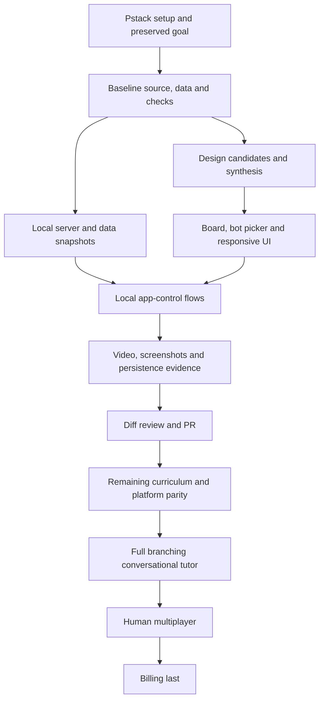

## Pstack workflow
- [x] Read the Principles section of poteto-mode in full.
- [x] Phase A: Frame.
- [x] Phase B: Design the workflow.
- [x] Phase C: Run the loop.
- [x] Run setup-pstack with host-confirmed model routing and preserve previous configuration.
- [x] Trace existing account, game, engine and study flows; capture baseline checks.
- [x] Capture the baseline visual state.
- [x] Compare two design shapes and choose the implementation boundary.
- [x] Serve app and archives locally; retain both account databases with safe snapshots.
- [x] Rebuild the bot picker and visual system without changing game integrity.
- [x] Create and execute the project verification skill and feature map.
- [x] Exercise desktop/mobile user flows and record video proof.
- [x] Phase D: Keep the audit trail.
- [ ] Phase E: Verify and hand back.
- [ ] Open the reviewed PR with video proof and explicit gaps.

## Engineering graph

The full goal remains active until the original parity objective is verified. This graph orders work; it does not certify vendor equivalence. Team and independent-agent execution currently fail at the installed Astra runtime validator. No validator bypass is authorized by this document.
